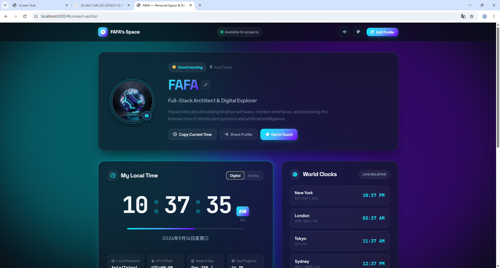
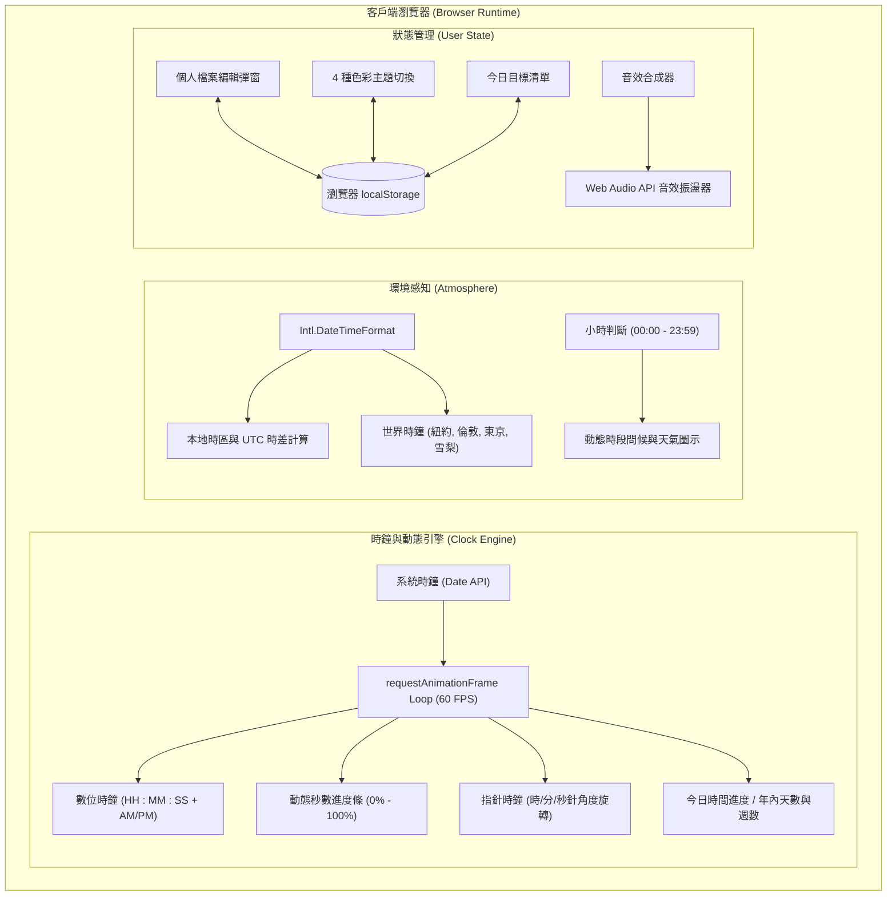
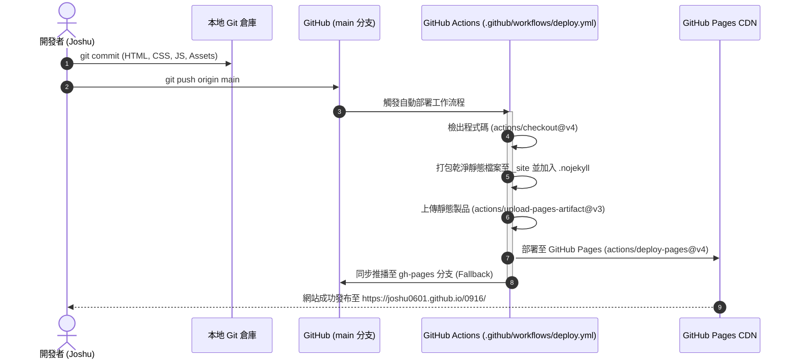

# 0916 — Joshu's Personal Space & Real-Time Clock



A modern personal website featuring live local time, dynamic time-of-day greetings, interactive profile customization, core technical skills, featured projects showcase, and multiple visual themes.

🌐 **線上網站 (Live Demo)**: [https://joshu0601.github.io/0916/](https://joshu0601.github.io/0916/)

---

## 📋 本作業 5 大核心功能檢驗表 (Requirements Checklist)

| 序號 | 項目 (Feature) | 頁面呈現與實作說明 (Implementation Details) |
|:---:|:---|:---|
| **👤 1** | **Profile (個人介紹)** | • **姓名**：Joshu<br>• **個人頭像**：自定義 3D 幾何賽博美學 Avatar（支援自訂網址）<br>• **科系**：資訊工程學系 (Computer Science & Information Engineering)<br>• **專長**：Web Dev · AI/ML · IoT · 系統設計<br>• **自我介紹**：熱愛探索前沿軟體架構、人機互動介面與人工智慧應用，致力於打造高效能、具直覺美感與流暢互動體驗的現代化數位產品。 |
| **🛠 2** | **Skills (核心技能)** | 至少列出 3 項技能，本專案完整呈現 6 大領域：<br>1. **Python**：數據分析、ML 模型推論與後端服務<br>2. **C / C++**：演算法、底層資料結構與嵌入式開發<br>3. **Web Development**：HTML5, Modern CSS (Glassmorphism), Vanilla JS<br>4. **Machine Learning & AI**：預測模型、神經網路與邊緣運算<br>5. **IoT (物聯網應用)**：微控制器整合、MQTT 輕量級協議<br>6. **Data Analysis**：數據清洗、統計分析與 Pandas/NumPy 視覺化 |
| **🚀 3** | **Projects (專案作品)** | • **專案 1 (現正上線)**：`0916 — Personal Web & Live Clock`<br>  - 技術：HTML5, Modern CSS, Vanilla JS, Web Audio API, GitHub Actions<br>  - 連結：[GitHub Repo](https://github.com/joshu0601/0916) · [Live Demo](https://joshu0601.github.io/0916/)<br>• **專案 2 (本學期預計完成)**：`Smart Edge AI & IoT Assistant`<br>  - 說明：微控制器與輕量化 ML 之智慧環境監測系統，微秒級低延遲感測與雲端告警<br>  - 技術：Python, C/C++, IoT, Machine Learning, MQTT |
| **🕐 4** | **Live Clock (即時時鐘)** | • **即時時間更新**：使用 JavaScript `requestAnimationFrame` 與系統時鐘同步，精確顯示 `HH : MM : SS`<br>• **功能亮點**：AM/PM 指示、秒數進度條 (0-60s)、即時指針鐘 (Analog) 雙視圖切換、本地時區自動偵測 (`Intl.DateTimeFormat`) 與 UTC 時差計算、今日時間流逝百分比 |
| **🎨 5** | **Personal Design (個人風格)** | • **視覺美學**：極致毛玻璃擬態 (Glassmorphism) 與動態漂浮光暈背景 (Floating Mesh Glow)<br>• **4 款主題即時切換**：Midnight Obsidian (暗黑星系)、Aurora Borealis (極光翡翠)、Sunset Horizon (日落暖霞)、Daylight Minimal (極簡白日)<br>• **字型搭配**：Google Fonts（Plus Jakarta Sans、Space Grotesk、JetBrains Mono、Noto Sans TC）<br>• **微互動**：卡片 Hover 上浮懸停、Web Audio API 擬真音效開關、自訂資料 Modal 與 localStorage 本地持久化 |

---

## 🔄 專案架構與工作流程 (Workflows)

### 1. 前端客戶端資料流 (Client Runtime Data Flow)



### 2. GitHub Pages CI/CD 自動化部署流程



---

## 💻 本地端運行方式 (Local Development)

1. 複製倉庫至本機：
   ```bash
   git clone https://github.com/joshu0601/0916.git
   cd 0916
   ```

2. 啟動輕量靜態伺服器：
   ```bash
   python -m http.server 8000
   ```

3. 於瀏覽器開啟 `http://localhost:8000` 即可檢視完整動態效果。

---

## 🛠️ 技術棧 (Built With)

- **HTML5**：語意化結構、完整 SEO 與社群分享標籤。
- **Modern CSS**：自定義 CSS 變數、進階玻璃態擬物美學（Glassmorphism）、流暢 60FPS CSS Keyframe 動畫。
- **Vanilla JavaScript**：純原生 JavaScript、零外部打包工具相依、高效能 `requestAnimationFrame` 即時運算。
- **Web Audio API**：原生音訊合成器（Oscillator）實作報時點擊音效。
- **GitHub Actions & Pages**：自動化持續整合與靜態網頁託管。
- **Google Fonts & FontAwesome**：Plus Jakarta Sans、Space Grotesk、JetBrains Mono、Noto Sans TC 與現代向量圖示。

---

## 📄 License

MIT © [Joshu](https://github.com/joshu0601)
