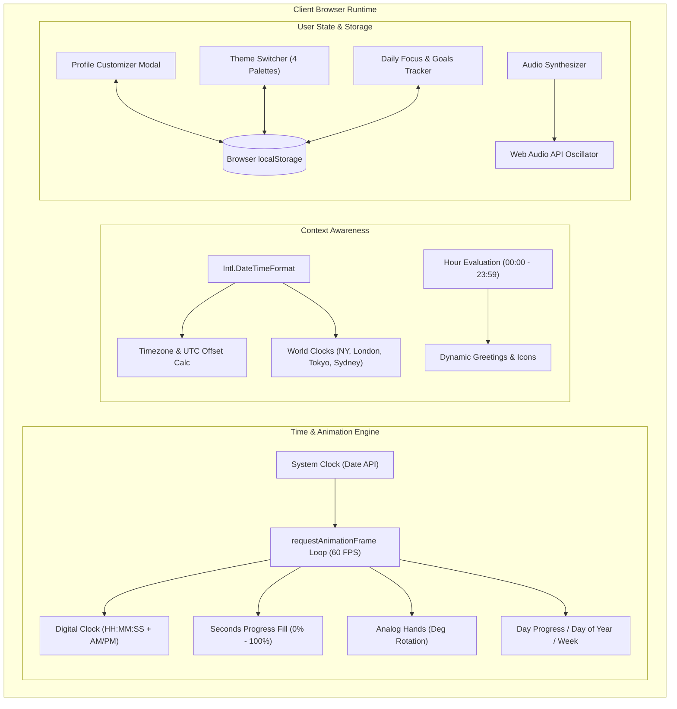
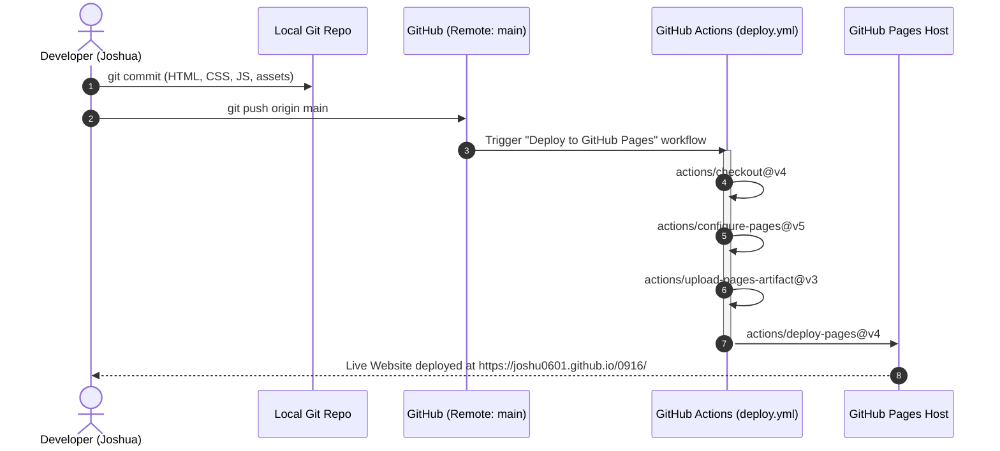

# 0916 — Personal Web & Real-Time Clock


A modern personal website featuring live local time, dynamic time-of-day greetings, interactive profile customization, global world clocks, and multiple visual themes.

🌐 **Live Demo**: [https://joshu0601.github.io/0916/](https://joshu0601.github.io/0916/)

---

## 🔄 Project Architecture & Workflow

### 1. Application Runtime Data Flow



### 2. GitHub Pages CI/CD Deployment Workflow



---

## 🚀 How to Enable GitHub Pages Deployment

This repository includes an automated GitHub Actions deployment workflow in [`.github/workflows/deploy.yml`](.github/workflows/deploy.yml).

Follow these simple steps to activate your live site:

1. **Open Repository Settings**:
   - Go to [https://github.com/joshu0601/0916/settings/pages](https://github.com/joshu0601/0916/settings/pages).
2. **Set Build and Deployment Source**:
   - Under **Build and deployment** > **Source**, select **GitHub Actions**.
3. **Trigger Deployment**:
   - Every push to the `main` branch automatically builds and deploys the site.
   - You can also trigger it manually under the **Actions** tab by selecting **Deploy to GitHub Pages** > **Run workflow**.
4. **Access Your Live Website**:
   - Your site will be published at: **[https://joshu0601.github.io/0916/](https://joshu0601.github.io/0916/)**

---

## ✨ Features

- ⏱️ **Real-Time Local Clock**:
  - Millisecond-accurate rendering with live ticking seconds and seconds progression bar.
  - Dual view modes: **Digital Precision** and **Minimalist Analog Clock**.
  - Local timezone auto-detection (`Intl.DateTimeFormat`) and UTC offset display.
  - Day progress percentage, day-of-year, and week-of-year tracking.
- 🌅 **Dynamic Greetings**: Automatically adapts greetings and icons based on the user's local hour (morning, afternoon, evening, and night).
- 🎨 **Multi-Theme Switcher**:
  - **Midnight Obsidian**: Deep space dark mode with electric cyan & neon purple accents.
  - **Aurora Borealis**: Mystic emerald & teal illumination.
  - **Sunset Horizon**: Twilight plum with warm amber & coral glow.
  - **Daylight Minimal**: Crisp, frosted glass with clean slate & ocean blue.
- 👤 **Interactive Profile Editor**:
  - Inline editing for name, title, bio, email, and status.
  - State persisted locally using `localStorage`.
- 🌍 **Global World Clocks**: Real-time relative clock comparisons for New York, London, Tokyo, and Sydney.
- 🎯 **Daily Focus & Productivity**: Interactive checklist for daily goals with local persistence.
- 🔊 **Audio Chime Toggle**: Subtle synthesized audio feedback via Web Audio API.

---

## 💻 Local Development

1. Clone the repository:
   ```bash
   git clone https://github.com/joshu0601/0916.git
   cd 0916
   ```

2. Run a lightweight local HTTP server:
   ```bash
   python -m http.server 8000
   ```

3. Open `http://localhost:8000` in your web browser.

---

## 🛠️ Built With

- **HTML5**: Semantic, accessible document structure.
- **Modern CSS**: Vanilla CSS with custom properties, backdrop blur glassmorphism, and responsive grid.
- **Vanilla JavaScript**: Pure zero-dependency modern JS for real-time engine and state management.
- **GitHub Actions**: Automated CI/CD deployment pipeline for GitHub Pages.
- **Google Fonts**: Plus Jakarta Sans, Space Grotesk, and JetBrains Mono.
- **FontAwesome**: Crisp modern vector icons.

---

## 📄 License

MIT © [Joshua](https://github.com/joshu0601)
